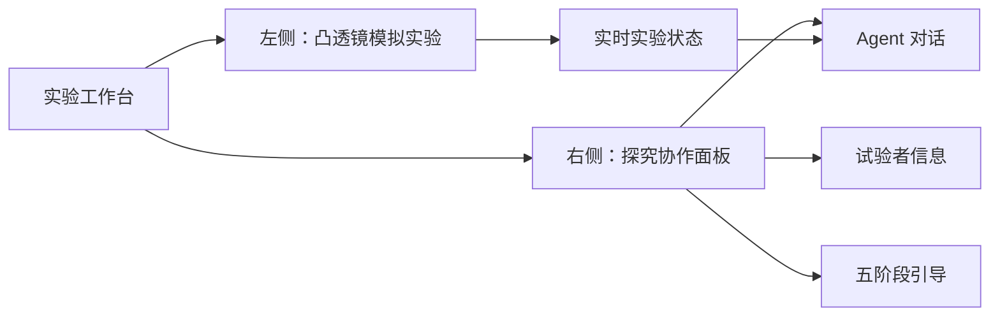

# 凸透镜探究智能实验平台 PRD

| 项目 | 内容 |
| --- | --- |
| 文档版本 | v0.1 |
| 日期 | 2026-05-27 |
| 阶段 | 产品与前端设计基线 |
| 目标平台 | Web，优先支持学校电脑与横屏平板 |
| 核心用户 | 参加物理探究学习的初中学生 |

## 1. 产品概述

### 1.1 背景

学生需要在操作凸透镜成像模拟实验的同时，经历科学探究的完整过程：观察并界定问题、提出假设、设计实验、采集证据、评估证据。单独的模拟器可以展示成像结果，但不能持续促使学生解释现象、记录证据并反思结论。

本产品在同一屏幕中组合实验操作区与对话式 Agent。Agent 不替学生完成实验，而是使用分阶段提示、追问和反馈，引导学生把操作行为转化为科学推理。

### 1.2 产品目标

- 学生无需切换页面即可操作凸透镜实验并获得探究引导。
- 用五个阶段按钮降低学生发起有效科学对话的门槛。
- Agent 能结合实验的当前状态进行提问和反馈，而不是只输出通用知识。
- 为课堂协作保留必要的试验者/小组上下文，避免不必要的个人信息采集。

### 1.3 成功指标

首版上线后可采用以下课堂观察指标，数值目标需在试教后校准：

| 指标 | 定义 | 初始目标 |
| --- | --- | --- |
| 五阶段到达率 | 一次会话中至少触发过 4 个不同阶段的学生组比例 | >= 70% |
| 有效证据对话率 | 会话包含物距/焦距或成像性质观察描述的比例 | >= 70% |
| 任务完成时间 | 从开始到提交结论的中位时间 | 课堂规定时间内 |
| 技术成功率 | 页面加载、实验交互及聊天均可完成的会话比例 | >= 95% |

## 2. 用户与使用场景

### 2.1 用户角色

| 角色 | 需求 | 权限 |
| --- | --- | --- |
| 学生/学生小组 | 操作实验、向 Agent 求助、形成结论 | 填写本组信息、操作实验、聊天 |
| 教师 | 组织课堂、查看完成情况（后续） | MVP 不提供后台；可提供任务编号 |
| 系统管理员 | 配置模型和运行环境（后续） | 不在学生界面暴露 |

### 2.2 典型场景

1. 两名学生打开课堂链接，填写班级、组号和昵称。
2. 学生在左侧拖动物距与焦距，观察实像、虚像、大小与倒正变化。
3. 学生依次点击五个探究按钮，由 Agent 提供当前阶段的科学方法提示与问题。
4. 学生把观察、预测和结论输入聊天区，Agent 通过追问帮助修正表述。
5. 学生在第五阶段对比假设和证据，完成本次探究结论。

## 3. 输入材料分析与关键决定

### 3.1 参考 HTML 已提供的能力

用户提供的 `deepseek_html_20260527_520198.html` 是一个 701 行单页原型，包含：

- 左侧 Canvas 凸透镜模拟，支持调节物距 `u` 和焦距 `f`。
- 成像计算与画面表达：实像/虚像、倒正、放大率、焦点和 `2F` 标识。
- 右侧小组表单、五阶段按钮和聊天消息区域。
- 聊天为前端写死的模拟响应，尚未接入真实 Agent。

### 3.2 与正式需求的差异

| 原型现状 | 正式设计处理 |
| --- | --- |
| 原型整页同时含实验区和右侧面板 | 左栏只嵌入“实验视图”；右栏由主应用统一实现 |
| 标题为“教师填写小组信息” | 改为“试验者信息”，适合学生自主填写 |
| 表单含“高/低先验知识学习者”并直接展示 | MVP 默认不采集此标签，避免给学生贴标签；研究确需时作为教师侧配置另行确认 |
| 聊天回复硬编码 | 通过后端 Agent API 生成，并有教育引导规则 |
| 原型按钮文案/回复非指定模板 | 采用需求给定的五组提示词作为版本化内容源 |

### 3.3 嵌入决策

参考 HTML 不能以当前整页形式直接放入左栏，否则新旧右侧面板会重复出现。MVP 应采用以下其一，优先选择方案 A：

| 方案 | 做法 | 结论 |
| --- | --- | --- |
| A. 提炼实验视图 | 从原型提取 Canvas、控件及计算脚本为独立 `/experiment/lens-simulator.html`，由 `iframe` 加载 | 推荐；边界清晰，便于保留现有模拟器逻辑 |
| B. 嵌入模式 | 为原型增加 `embed=1` 模式，隐藏其右侧面板和外层多余样式 | 过渡方案；维护成本较高 |
| C. React 重写模拟器 | 将绘图和控制逻辑改写为主应用组件 | 非 MVP；只有需深度联动或无障碍增强时再评估 |

## 4. 产品范围

### 4.1 MVP 范围

- 单页双栏实验工作台。
- 左侧嵌入凸透镜模拟实验视图。
- 右侧试验者信息表单及会话内保存。
- 五个探究步骤按钮，触发已指定提示词。
- 对话式 Agent 的消息列表、输入和回复状态。
- 将实验当前状态传递给 Agent 请求上下文。
- 基础错误处理、键盘可操作性和响应式布局。

### 4.2 不在 MVP 范围

- 教师管理后台、班级统计仪表盘。
- 登录、长期学生档案与跨设备会话同步。
- 自动评分或对学生能力进行分类。
- 语音输入、图片识别、实验报告导出。
- 对参考模拟器物理模型进行高级扩展。

## 5. 信息架构与主流程

### 5.1 页面信息架构



### 5.2 学习流程

| 阶段 | 学生行为 | Agent 作用 | 阶段输出 |
| --- | --- | --- | --- |
| 进入实验 | 填写试验者信息，观察默认画面 | 说明任务和操作方式 | 小组上下文 |
| 1 观察与界定 | 描述可改变量与成像现象 | 示例说明如何提出科学问题 | 待研究问题 |
| 2 假设 | 预测变量变化后的像性质 | 解释可检验假设的准则 | 可验证假设 |
| 3 设计 | 规划改变/控制/观察变量 | 解释控制变量，并迁移到本实验 | 实验计划 |
| 4 采证 | 操作实验并记录观察 | 解释实像/虚像、焦点情形，追问数据 | 证据记录 |
| 5 评估 | 对照假设与观察作结论 | 解释不一致并促使反思 | 结论与改进建议 |

## 6. 功能需求

### 6.1 实验区

| 编号 | 需求 | 优先级 | 验收标准 |
| --- | --- | --- | --- |
| EXP-01 | 左侧展示可操作的凸透镜实验视图 | P0 | 桌面端进入页面后无需滚动即可看到实验画面和核心控制项 |
| EXP-02 | 支持改变物距与焦距并即时更新成像 | P0 | 控件变化后画面与状态在可感知的即时反馈内更新 |
| EXP-03 | 暴露结构化实验状态给主应用 | P0 | 主应用可收到 `u`、`f`、像距、像类型、倒正及放大率 |
| EXP-04 | 不展示旧原型自带的表单或聊天界面 | P0 | 左栏不存在重复右侧面板或嵌套页面标题冲突 |
| EXP-05 | 明确特殊状态 | P1 | `u = f` 时页面用学生可理解的提示说明无法在屏上得到清晰像 |

### 6.2 试验者信息

| 编号 | 需求 | 优先级 | 验收标准 |
| --- | --- | --- | --- |
| INFO-01 | 展示“试验者信息”卡片 | P0 | 页面右上方可识别，文案不暗示必须由教师填写 |
| INFO-02 | 收集最小必要信息 | P0 | 包含班级/任务编号（可选）、小组编号、成员昵称或姓名；无默认真实姓名 |
| INFO-03 | 信息保存反馈 | P0 | 点击保存后显示当前小组摘要并在对话中出现确认状态 |
| INFO-04 | 会话上下文使用信息 | P1 | Agent 可称呼小组编号或昵称，不输出未填写字段 |
| INFO-05 | 保护学生信息 | P0 | MVP 不默认持久化个人信息，界面告知仅用于本次实验会话 |

### 6.3 五阶段引导按钮

| 编号 | 需求 | 优先级 | 验收标准 |
| --- | --- | --- | --- |
| STEP-01 | 展示五个顺序明确的阶段按钮 | P0 | 按钮名称和阶段顺序与需求一致 |
| STEP-02 | 点击按钮触发指定提示词 | P0 | 每个按钮将对应的两条问题以结构化消息发送给 Agent；文本与 [AGENT_PROMPTS.md](AGENT_PROMPTS.md) 一致 |
| STEP-03 | 显示当前阶段状态 | P0 | 已激活步骤有可视状态，且不依赖颜色单独表达 |
| STEP-04 | 允许回看和重复提问 | P1 | 重复点击不会覆盖历史消息，可重新触发同阶段引导 |
| STEP-05 | 方法迁移说明 | P0 | 第 1 至 3 步提及滑动摩擦力示例时，Agent 在回复结尾提示如何迁移到当前凸透镜实验 |

### 6.4 对话式 Agent

| 编号 | 需求 | 优先级 | 验收标准 |
| --- | --- | --- | --- |
| CHAT-01 | 消息发送与历史展示 | P0 | 学生输入可发送，消息区区分学生与 Agent，自动滚动至最新消息 |
| CHAT-02 | 步骤快捷消息 | P0 | 步骤触发的消息带阶段标识，学生可看见系统正在讨论的问题 |
| CHAT-03 | 结合实验状态 | P0 | 请求 Agent 时携带最近的实验状态；无法获取状态时不得伪造观察结果 |
| CHAT-04 | 加载与错误恢复 | P0 | 请求中显示生成状态；失败时显示可重试且保留学生输入 |
| CHAT-05 | 教育引导口吻 | P0 | 回复适合初中学生、先追问或提示观察再给解释，不替学生虚构记录 |
| CHAT-06 | 服务安全 | P0 | API 密钥仅存在服务端；输入和模型输出按安全策略处理 |
| CHAT-07 | 会话清理 | P1 | 可新建会话或清空聊天，并在清除前要求确认 |

## 7. 指定步骤内容

按钮触发的完整文本及 Agent 行为约束以 [Agent 提示词规范](AGENT_PROMPTS.md) 为唯一内容源。阶段标题固定为：

| 步骤 | 按钮标题 | 学习目的 |
| --- | --- | --- |
| 1 | 共同观察与问题界定 | 学会从现象提出可研究问题 |
| 2 | 提出并确认假设 | 形成能用证据检验的预测 |
| 3 | 协作设计实验 | 识别改变、控制和观测变量 |
| 4 | 协作采集证据 | 理解像的性质并记录关键现象 |
| 5 | 协作评估证据 | 用证据评价假设并解释偏差 |

## 8. Agent 行为要求

### 8.1 回复策略

- 使用简洁、准确、面向初中学生的中文，不用居高临下的评价。
- 每次阶段回复优先给一个可立即操作或思考的问题，避免整段给出最终结论。
- 对于学生的观察，区分“已从实验状态获得的数据”和“学生尚未验证的推断”。
- 学生提出错误结论时，以反例操作或追问引导修正。
- 第 1 至 3 步的摩擦力例子仅用于示范探究方法，不将摩擦力结论混写为本实验结论。

### 8.2 请求上下文

一次 Agent 请求应包含：

```ts
type AgentRequest = {
  sessionId: string;
  activeStep: 1 | 2 | 3 | 4 | 5 | null;
  studentMessage: string;
  triggeredTemplateId?: "step-1" | "step-2" | "step-3" | "step-4" | "step-5";
  participantContext: {
    groupId?: string;
    displayNames: string[];
  };
  experimentState?: {
    objectDistanceCm: number;
    focalLengthCm: number;
    imageDistanceCm?: number;
    imageType: "real" | "virtual" | "none";
    orientation?: "upright" | "inverted";
    magnification?: number;
  };
};
```

### 8.3 内容与隐私边界

- 不要求学生填写电话、账号、家庭信息等与实验无关的数据。
- 不根据对话给学生贴“能力高低”标签。
- 若未来需要保存对话用于研究或教学分析，应在开始前展示用途、保存周期和授权流程。
- 不让模型声称读取到了模拟器状态，除非请求上下文确实携带状态。

## 9. 非功能需求

| 分类 | 要求 |
| --- | --- |
| 兼容性 | MVP 支持当前版本 Chrome/Edge；分辨率以 `1280 x 720` 以上课堂设备为首要目标 |
| 性能 | 首屏主要 UI 可交互目标 <= 2 秒（局域网/正常校园网络基线待测）；实验拖动保持流畅 |
| 可用性 | 核心操作无需页面横向滚动；错误可恢复；聊天文本可选择复制 |
| 可访问性 | 表单有标签；按钮可键盘操作；焦点可见；文本对比度满足 WCAG AA 基本目标 |
| 安全性 | 模型密钥不下发浏览器；验证 iframe 消息来源与数据结构；渲染 Agent 文本时转义 HTML |
| 可维护性 | TypeScript 严格模式、组件分层、集中定义提示词、提供基础测试与 lint/format 流程 |

## 10. 数据、事件与集成

### 10.1 iframe 事件协议

独立实验视图通过 `window.postMessage` 向主应用报告状态，外层只接受指定来源和已验证的事件：

```ts
type LensEvent =
  | {
      type: "lens/state-changed";
      payload: {
        objectDistanceCm: number;
        focalLengthCm: number;
        imageDistanceCm?: number;
        imageType: "real" | "virtual" | "none";
        orientation?: "upright" | "inverted";
        magnification?: number;
      };
    }
  | { type: "lens/ready" };
```

### 10.2 数据保留建议

| 数据 | MVP 存储方式 | 原因 |
| --- | --- | --- |
| 试验者显示信息 | 浏览器会话内状态 | 最小化学生信息保存 |
| 实验即时状态 | 内存状态 | 只用于当前引导 |
| 聊天记录 | 当前页面会话；是否服务端留存待确认 | 取决于课堂/研究合规需求 |
| API 密钥 | 服务端环境变量 | 禁止暴露到前端 |

## 11. 验收流程

### 11.1 核心验收场景

1. 打开工作台，左侧仅看到凸透镜实验，右侧看到试验者信息、五按钮与聊天区。
2. 不填必填项直接保存，表单明确提示，不发送无效上下文给 Agent。
3. 填写小组信息并保存，消息区显示不含多余个人信息的确认消息。
4. 调节物距或焦距，右侧后续对话可引用实际状态。
5. 依次点击五按钮，核对触发内容与提示词规范逐字一致。
6. 在 `u = f` 情形提问，Agent 以该状态为依据解释观察而不伪造成像数据。
7. 模拟 Agent API 超时，页面保留输入且提供重新发送。
8. 使用键盘完成表单输入、阶段按钮选择及消息发送。

### 11.2 上线前质量门槛

- `lint`、类型检查和测试通过。
- 无密钥、真实学生资料或本地环境文件提交到 Git。
- 已测试桌面主布局及窄屏降级布局。
- 指定提示词内容完成教师/需求方审阅。

## 12. 迭代路线

| 里程碑 | 交付内容 |
| --- | --- |
| M0 设计基线 | PRD、前端设计、Agent 提示词规范 |
| M1 静态工作台 | React 工程、双栏 UI、表单、步骤区、聊天静态状态 |
| M2 实验嵌入 | 独立实验视图、iframe 状态事件、特殊状态显示 |
| M3 Agent MVP | 后端代理、流式/非流式聊天、五按钮真实回复、错误处理 |
| M4 课堂验证 | 可用性测试、内容调整、隐私与数据留存决定 |

## 13. 待产品确认

- 最终是否需要收集真实姓名、班级和对话记录；若需要，须明确隐私告知与保存期限。
- 模型服务供应商、部署位置和网络限制。
- 课堂任务是否要求导出学生的实验结论或教师查看会话。
- “滑动摩擦力”示例是否必须原文发送，或允许在后续内容迭代中补充凸透镜专属示例。
